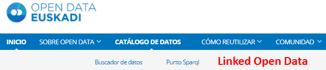

# Introducción
En este repositorio se encuentra una propuesta de Web de documentación sobre Linked Open Data (mayormente para desarrolladores) para añadir a Open Data Euskadi ([prototipo](prototipo.md)). En la Web de [Open Data Euskadi](http://opendata.euskadi.eus/inicio/), dicha web estaría al mismo nivel que las webs "Buscador de datos" y "Punto SPARQL":

