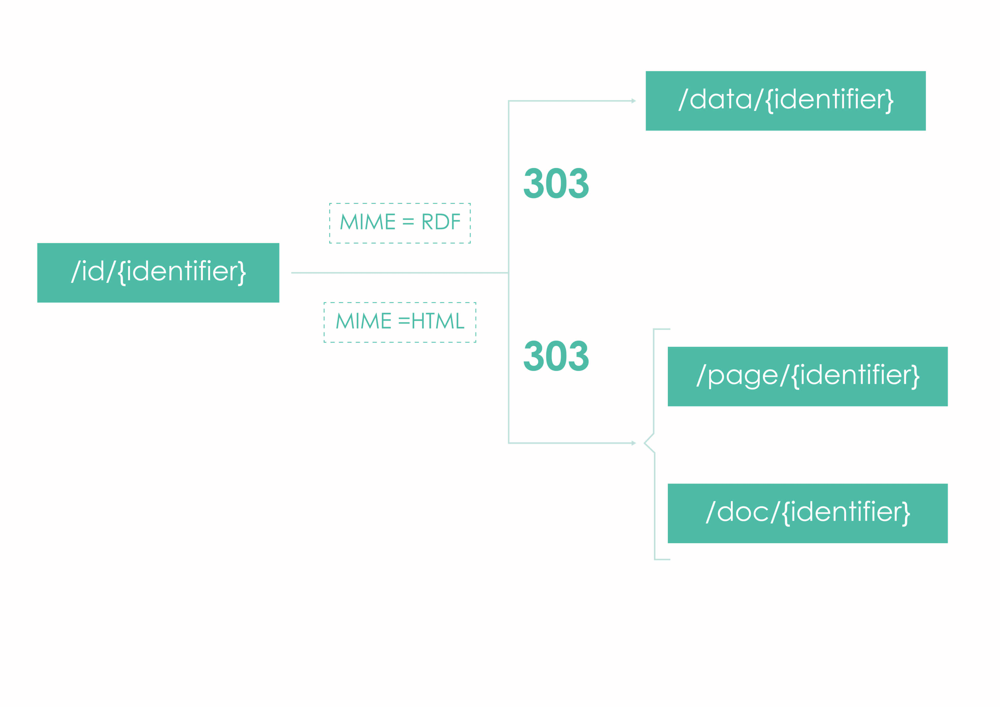
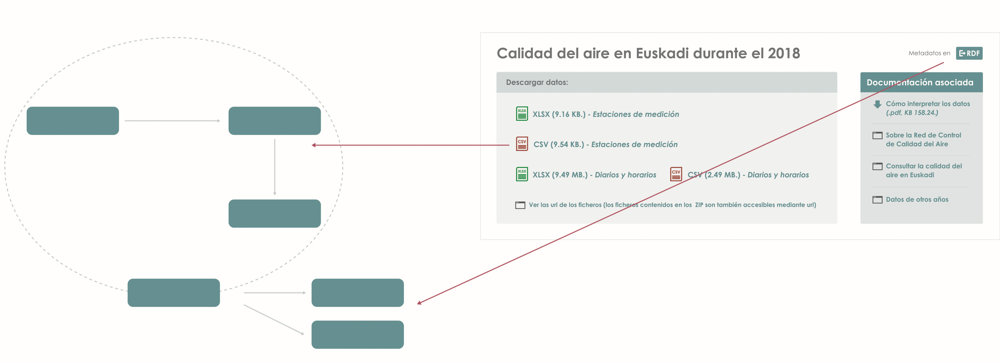

 Linked Open Data
================

## Introduction

The aim of Open Data initiatives like [Open Data Euskadi](http://opendata.euskadi.eus) is to publish government data in the most interoperable and rich way, so that citisens and other institutions can build interesting applications and perform deep analyses with the data. Linked Data offers a suitable technology to do so, through the so called Linked Open Data.

[](http://5stardata.info)

The idea behind [Linked Data](https://www.w3.org/standards/semanticweb/data) is to publish data directly on the Web, using current technologies, with standards like RDF, OWL, SHACL, and SPARQL. In order for such data to be useful, it must be identified with URIs, accessible through HTTP, and most importantly, linked to external Linked Data resources, to be a part of the Linked Open Data Cloud.

[](http://lod-cloud.net/versions/2017-08-22/lod.png)

By publishing Open Data as Linked Data, 3rd parties (humans or programs) can browse the data through links and perform interesting queries on integrated data.

In Open Data Euskadi, we have chosen data from different sources (Open Data Euskadi catalog, Legegunea, web content, etc.) and we have converted it to Linked Data. This documentation is provided to make the consumption of such data easier to developers, citisens, journalists, etc.

## Technology stack

### Linked Data

Linked Data is based on following four principles:

1. Identify every data item (entity or relationship) with a URI.

2. Make those URIs HTTP resolvable, that is, when the URI is requested a document containing information about the entity can be obtained.
 
3. When an entity is requested by HTTP, provide its information using an open formatting standard. The format provided should be determined by HTTP content negotiation between the client and the server (e.g. RDF for an automatic agent, or HTML for a human user), so that the entity and its representations are decoupled. Importantly, the RDF format should always be available.

4. Ensure, to the greatest extent possible, that the information provided by URI resolution contains typed relations to other entities, so that the agent can traverse those relations to discover new information, analogously to how humans browse the web. 

### Resource Description Framework (RDF)

RDF can be described as the ["HTML for data"](https://www.w3.org/TR/rdf11-primer/): a shared language for representing data on the Web. RDF is based on representing data as subject-predicate-object triples ("Bob"-"is interested in"-"Mona Lisa"): by gluing these triples together, we obtain a graph. Each entity (subject, predicate, or object) is identified by a URI, except objects, since they can also be literals (Numeric data, Strings, etc. -- see [XSD Datatypes](https://www.w3.org/TR/xmlschema-2/) -- ). RDF is stored in Triple Stores: [GraphDB](http://graphdb.ontotext.com/) is the one we use, through the RDF Java Framewor [RDF4J](http://rdf4j.org/).

### SPARQL

[SPARQL](https://www.w3.org/TR/sparql11-overview/) is a query language for RDF and standard API for accessing SPARQL endpoints. A Triple Store exposes a SPARQL endpoint.

### Web Ontology Language (OWL)

[OWL](https://www.w3.org/TR/owl2-primer/) is a Knowledge Representation language to build ontologies. An ontology is a vocabulary we use to describe general properties about the data we publish, through axioms. All the entities in an OWL Ontology are identified by URIs, except literals.

### Shapes Constraint Language (SHACL)

[SHACL](https://www.w3.org/TR/shacl/) is a language for validating RDF data. With SHACL, constrains can be defined, and check whether an RDF graph complies with them.

## URI policy

In Linked Data, resources are identified by URIs. This means that URIs should be persistent and well defined (See "Linked Data Best Practices" references bellow). We have followed the [NTI](https://www.boe.es/diario_boe/txt.php?id=BOE-A-2013-2380) scheme for URIs, with a caveat: instead of using the word "recurso", we are using the word "id" (We are aware that a URI bears no semantics and therefore "recurso" is as good as any word, but we live in a community with two official languages and we think we should not favor one over the other to build the URIs). Therefore, you can expect the resource URIs at Open Data Euskadi to follow the pattern `http://data.euskadi.eus/id/{Sector}/{Domain}/{ClassName}/{Identifier}`, where:

* `Sector`: one of the sectors provided by the NTI (e.g. `public-sector`), translated from spanish to english. The SKOS file with the sector names can be found [here](https://raw.githubusercontent.com/opendata-euskadi/SKOS-taxonomies/master/sectores-nti/skosnti.rdf).
* `Domain`: the realm to which the resource belongs, defined by Open Data Euskadi (e.g. `government`). The SKOS file with the domain names can be found [here](https://raw.githubusercontent.com/opendata-euskadi/SKOS-taxonomies/master/estructura-administracion/grafo.rdf).
* `ClassName`: the name of the class to which this resource belongs. In other words, the name of the resource at the other end of the `rdf:type` predicate (e.g. `GovernmentalAdministrativeRegion`, from `http://dbpedia.org/ontology/GovernmentalAdministrativeRegion`). See section "Ontologies used" bellow.
* `Identifier`: a unique identifier, generated from the original data (e.g. `euskadi`).

Therefore a real URI, identifying an observation of air quality that follows the [Data Cube](https://www.w3.org/TR/vocab-data-cube/) model, looks like: `http://data.euskadi.eus/id/public-sector/government/GovernmentalAdministrativeRegion/euskadi`.

Where:

* `Sector`:  `public-sector`.
* `Domain`: `government`. 
* `ClassName`: `GovernmentalAdministrativeRegion`.
* `Identifier`: `euskadi`.

Resource URIs of RDF data that was obtained from the [Legegunea](http://www.legegunea.euskadi.eus) service follow the URI pattern defined by the [European Legislation Identifier](http://eur-lex.europa.eu/eli-register/about.html) (ELI) project:

```
http://data.euskadi.eus/eli/{jurisdiction}/{type}/{year}/{month}/{day}/{naturalidentifier}/{version}/{pointintime}/{language}/{format}
```
 
Apart from resources, the following entities also have URI schemes defined: 

* OWL Classes: `http://data.euskadi.eus/def/{OntologyName}#{ClassName}`.
* OWL properties: `http://data.euskadi.eus/def/{OntologyName}#{PropertyName}`.
* OWL Ontology: `http://data.euskadi.eus/def/{OntologyName}`.
* SKOS Concept: `http://data.euskadi.eus/kos/{ConceptName}`.
* Dataset in a DCAT file: `http://data.euskadi.eus/dataset/{NamedGraph}`. For example, `http://data.euskadi.eus/dataset/bopv-european-legislation-identifier-eli/`.
* Distribution in a DCAT file: `http://data.euskadi.eus/distribution/{NamedGraph}/[lang]/format`. `lang` is optional. For example, `http://data.euskadi.eus/distribution/bopv-european-legislation-identifier-eli/lod`.
* Named Graph in a DCAT file or Triple Store: `http://data.euskadi.eus/graph/{NamedGraph}`. For example, `http://data.euskadi.eus/graph/bopv-european-legislation-identifier-eli`.

## Content negotiation
An important notion of Linked Data is that a URI identifies a resource (Euskadi), but a resource can have different representations of the same content (An HTML page describing Euskadi, RDF data describing Euskadi, etc.). [Content negotiation](https://tools.ietf.org/html/rfc7231#section-3.4) is the process by which the server provides the appropriate representation for each client, according to the MIME type of the `Accept` header provided by the client (`text/html` for a web browser, `application/rdf+xml` for an RDF agent, etc.).

The content negotiation process at Open Data Euskadi is designed in the same way as in DBpedia. There is a URI with the token `id` (`resource` in DBpedia), and the content negotiation process redirects the client with HTTP 303 codes to the appropriate URLs containing representations (`page` or `data` URLs). In the case of Open Data Euskadi there is an additional consideration since there are two types of pages: pages that represent only data (`doc`) and pages that represent web content that was transposed to RDF (`page`) (See section "Relation between Web content and Named Graphs in the Triple Store" bellow). 



The list of supported MIME types can be found at the [RDF4J REST API documentation](http://docs.rdf4j.org/rest-api/#_content_types).

## Relation between Open Data Euskadi datasets and Named Graphs in the Triple Store

[Named Graphs](https://www.w3.org/TR/sparql11-query/#namedGraphs) provide a mechanism to organise RDF triples into meaningful groups, since a Named Graph is a collection of RDF statements identified by a URI. Named Graphs are useful to organise the data in a Triple Store, and they also offer the possibility of recording the provenance of data in triples, since the URI of the named Graph can be the subject of more (metadata) triples.


The Named Graph and metadata mechanism is used at Open Data Euskadi to add provenance information to the RDF datasets generated from [Open Data Euskadi datasets](http://opendata.euskadi.eus/catalogo-datos/). Those datasets already have DCAT metadata, so the DCAT is "recycled" to obtain the metadata of the datasets that are created by converting existing Open Data Euskadi datasets to RDF (normally from CSV).



This excerpt from a DCAT file shows the appropriate triples (Not all the triples are shown):

```
@prefix dcat: <http://www.w3.org/ns/dcat#> .
@prefix dc: <http://purl.org/dc/terms/> .
@prefix dc11: <http://purl.org/dc/elements/1.1/> .
@prefix rdf: <http://www.w3.org/1999/02/22-rdf-syntax-ns#> .
@prefix ns0: <http://www.w3.org/2006/time#> .
@prefix rdfs: <http://www.w3.org/2000/01/rdf-schema#> .
@prefix xsd: <http://www.w3.org/2001/XMLSchema#> .
@prefix void: <http://rdfs.org/ns/void#> .
@prefix schema: <http://schema.org/> .
@prefix sd: <http://www.w3.org/ns/sparql-service-description#> .

<http://data.euskadi.eus/dataset/bopv-european-legislation-identifier-eli/>
  a dcat:Dataset ;
  dc:identifier "http://data.euskadi.eus/dataset/bopv-european-legislation-identifier-eli/" ;
  dc11:language "es", "eu" ;
  dc:title "Legislación de la Comunidad Autónoma de Euskadi (BOPV) - European Legislation Identifier (ELI)"@es, "Euskal Autonomia Erkidegoan Legedia (EHAA) - European Legislation Identifier (ELI)"@eu ;
  dc:description "Este conjunto de datos contiene la legislación de la Comunidad Autónoma de Euskadi."@es, "Datu-sorta honek Euskal Autonomia Erkidegoan legedia du."@eu ;
  dcat:distribution <http://data.euskadi.eus/distribution/eli-1936-1999/ttl>, <http://data.euskadi.eus/distribution/eli-2000-2015/ttl>, <http://data.euskadi.eus/distribution/eli-2016-2018/ttl>, <http://data.euskadi.eus/distribution/bopv-european-legislation-identifier-eli/lod> ;
  dcat:keyword "normas"@es, "normativa"@es, "leyes"@es, "país vasco"@es, "euskadi"@es, "decreto"@es, "orden"@es, "ley"@es, "instrucción"@es, "directiva"@es, "circular"@es, "acuerdo"@es, "recurso"@es, "reglamento"@es, "resolución"@es, "decisión"@es, "BOPV"@es, "legegunea"@es, "arauak"@eu, "arautegia"@eu, "legedia"@eu, "euskadi"@eu, "dekretua"@eu, "agindua"@eu, "legea"@eu, "jarraibidea"@eu, "orientabidea"@eu, "zuzentaraua"@eu, "akordioa"@eu, "erreglamendua"@eu, "zirkularra"@eu, "eskumena"@eu, "ebazpena"@eu, "hitzarmena"@eu, "erabakia"@eu, "EHAA"@eu, "legegunea"@eu ;
  dcat:theme <http://datos.gob.es/kos/sector-publico/sector/sector-publico>, <http://datos.gob.es/kos/sector-publico/sector/legislacion-justicia> ;
  dc:publisher <http://datos.gob.es/recurso/sector-publico/org/Organismo/A16003011> ;
  dc:license <https://creativecommons.org/licenses/by/4.0/deed.es_ES> ;
  dc:references <http://www.legegunea.euskadi.eus/x59-formbusa/es/contenidos/recurso_tecnico/legesarea_comun/es_busqueda/index.html#normativa>, <http://www.legegunea.euskadi.eus/x59-formbusa/eu/contenidos/recurso_tecnico/legesarea_comun/eu_busqueda/index.html#normativa>, <http://www.legegunea.euskadi.eus/x59-home/es/>, <http://www.legegunea.euskadi.eus/x59-home/eu>, <http://opendata.euskadi.eus/como-utilizar-datos/>, <http://opendata.euskadi.eus/datuak-nola-erabili/>, <http://opendata.euskadi.eus/como-reutilizar/-/contenidos/informacion/api_buscador_euskadinet/es_java/como_utilizar.html>, <http://opendata.euskadi.eus/nola-berrerabili/-/contenidos/informacion/api_buscador_euskadinet/eu_java/como_utilizar.html>, <http://opendata.euskadi.eus/w79-resformx/es/w79-resformx/es?r01kQry=tC:euskadi;tF:opendata;tT:ds_juridicos;m:contentName.LIKE.normas_leyes_euskadi,documentLanguage.EQ.es;p:Inter;>, <http://opendata.euskadi.eus/w79-resformx/eu/w79-resformx/eu?r01kQry=tC:euskadi;tF:opendata;tT:ds_juridicos;m:contentName.LIKE.normas_leyes_euskadi,documentLanguage.EQ.eu;p:Inter;> ;
  dc:spatial <http://datos.gob.es/recurso/sector-publico/territorio/autonomia/pais-vasco> ;
  dc:accrualPeriodicity [
    a dc:Frequency ;
    rdf:value [
      a <http://www.w3.org/2006/time#DurationDescription> ;
      ns0:weeks 1 ;
      rdfs:label "Semanal"
    ]
  ] ;
  dc:temporal [
    a dc:PeriodOfTime, ns0:Interval ;
    ns0:hasEnd [
      a ns0:Instant ;
      ns0:inXSDDateTime "2018-04-23T00:00:00"^^xsd:dateTime
    ] ;
    ns0:hasBeginning [
      a ns0:Instant ;
      ns0:inXSDDateTime "1936-01-01T00:00:00"^^xsd:dateTime
    ]
  ] ;
  dc:issued "2018-04-16T00:00:00"^^xsd:date ;
  dc:modified "2018-04-23T00:00:00"^^xsd:date .

<http://data.euskadi.eus/distribution/eli-1936-1999/ttl>
  a dcat:Distribution ;
  dc:format [
    a dc:IMT ;
    rdfs:label "RDF-Turtle" ;
    rdf:value "text/turtle"
  ] ;
  dcat:byteSize 28014712.0 ;
  dcat:accessURL "http://opendata.euskadi.eus/contenidos/ds_juridicos/dataset_eli/opendata/dataset_eli_1936_1999.ttl"^^xsd:anyURI ;
  dc:title "Legislación BOPV (1936-1999) - ELI"@es, "EHAA Legedia (1936-1999) - ELI"@eu .

<http://data.euskadi.eus/distribution/eli-2000-2015/ttl>
  a dcat:Distribution ;
  dc:format [
    a dc:IMT ;
    rdfs:label "RDF-Turtle" ;
    rdf:value "text/turtle"
  ] ;
  dcat:byteSize 125860268.0 ;
  dcat:accessURL "http://opendata.euskadi.eus/contenidos/ds_juridicos/dataset_eli/opendata/dataset_eli_2000_2015.ttl"^^xsd:anyURI ;
  dc:title "Legislación BOPV (2000-2015) - ELI"@es, "EHAA Legedia (2000-2015) - ELI"@eu .

<http://data.euskadi.eus/distribution/eli-2016-2018/ttl>
  a dcat:Distribution ;
  dc:format [
    a dc:IMT ;
    rdfs:label "RDF-Turtle" ;
    rdf:value "text/turtle"
  ] ;
  dcat:byteSize 34398013.0 ;
  dcat:accessURL "http://opendata.euskadi.eus/contenidos/ds_juridicos/dataset_eli/opendata/dataset_eli_2016_2018.ttl"^^xsd:anyURI ;
  dc:title "Legislación BOPV (2016-2018) - ELI"@es, "EHAA Legedia (2016-2018) - ELI"@eu .

<http://data.euskadi.eus/distribution/bopv-european-legislation-identifier-eli/lod>
  a dcat:Distribution, void:Dataset, schema:Distribution ;
  sd:namedGraph <http://data.euskadi.eus/graph/bopv-european-legislation-identifier-eli> ;
  void:sparqlEndpoint <http://data.euskadi.eus/sparql/> ;
  dc:title "Legislación BOPV - ELI (Linked Data)"@es, "EHAA Legedia - ELI (Linked Data)"@eu .

```

This means that SPARQL can be used to [query data and metadata]().

## Relation between Web content and Named Graphs in the Triple Store

Many webs of the [euskadi.eus](http://euskadi.eus) domain have been annotated with terms from the [Schema vocabulary](http://schema.org), adding [JSON-LD](https://json-ld.org/) snippets to them. Since JSON-LD is RDF, the content created for the webs is also stored in the Triple Store.

## Ontologies used

Even though different ontologies have been used in the RDF data, the URIs of the classes and properties of such ontologies can be found in [Euskadipedia](), the OWL ontology we maintain with external and internal entities.

## To know more

### Specifications, standards, and general purpose vocabularies

* URI (Uniform Resource Identifier): https://tools.ietf.org/html/rfc3986
* RDF (Resource Description Framework): https://www.w3.org/TR/rdf11-primer/
* OWL (Web Ontology Language): https://www.w3.org/TR/owl2-primer/
* SPARQL (SPARQL Protocol and RDF Query Language): https://www.w3.org/TR/sparql11-query/
* SHACL (Shapes Constraint Language): https://www.w3.org/TR/shacl/
* SKOS (Simple Knowledge Organization System): https://www.w3.org/TR/2009/NOTE-skos-primer-20090818/
* DCAT (Data Catalog Vocabulary): https://www.w3.org/TR/vocab-dcat/
* VOID (Vocabulary of Interlinked Datasets): https://www.w3.org/TR/void/
* PROV: https://www.w3.org/TR/prov-overview/
* JSON-LD: https://www.w3.org/TR/json-ld/
* Schema: http://schema.org/

### Tools used in the project

* ELDA: http://epimorphics.github.io/elda/
* YASGUI: http://about.yasgui.org/
* GraphDB: http://graphdb.ontotext.com/
* RDF4J: http://rdf4j.org/
* Jena: http://jena.apache.org/
* Protégé: https://protege.stanford.edu/
* Silk: http://silkframework.org/
* LODE: http://www.essepuntato.it/lode
* TopBraid SHACL API: https://github.com/TopQuadrant/shacl

### Online tools

* W3C RDF validator: https://www.w3.org/RDF/Validator/
* Easy RDF converter: http://www.easyrdf.org/converter

### Other Linked Open Data projects

* Biblioteca Nacional de España: http://www.bne.es/es/Inicio/Perfiles/Bibliotecarios/DatosEnlazados/index.html
* Aragón Open Data: https://opendata.aragon.es/aragopedia/
* Ordnance Survey Linked Data Platform: http://data.ordnancesurvey.co.uk/
* Scotland statistics: http://statistics.gov.scot/
* Office for National Statistics Geography Linked Data: http://statistics.data.gov.uk/
* Statistical Linked Open Data of Japan: http://data.e-stat.go.jp/lodw/en
* British National Library: http://bnb.data.bl.uk/
* British parliament: http://www.data.parliament.uk/
* Wikidata: https://www.wikidata.org/
* DBpedia: http://wiki.dbpedia.org/
* GeoNames: http://www.geonames.org/
* European Legislation Identifier: http://eur-lex.europa.eu/eli-register/about.html

### Interesting articles and posts

* JSON-LD and why I hate the Semantic Web: http://manu.sporny.org/2014/json-ld-origins-2/
* httpRange-14: What is the range of the HTTP dereference function?: https://www.w3.org/2001/tag/issues.html#httpRange-14
* What is your RDF browser's Accept header?: http://richard.cyganiak.de/blog/2008/03/what-is-your-rdf-browsers-accept-header/
* Apache Content Negotiation: http://httpd.apache.org/docs/current/content-negotiation.html
* Architecture of the World Wide Web, Volume One: https://www.w3.org/TR/webarch/
* W3C URI persistence policy: https://www.w3.org/Consortium/Persistence
* Content negotiation: Why it is useful, and how to make it work: https://www.w3.org/blog/2006/02/content-negotiation/

### Linked Data Best Practices

* NTI: https://www.boe.es/diario_boe/txt.php?id=BOE-A-2013-2380
* Linking Open Government Data: https://logd.tw.rpi.edu/instance-hub-uri-design
* Designing URI Sets for the UK Public Sector: https://www.gov.uk/government/publications/designing-uri-sets-for-the-uk-public-sector
* Creating URIs: https://data.gov.uk/resources/uris
* Data On the Web Best Practices: https://www.w3.org/TR/dwbp/
* Study on Persistent URIs: http://philarcher.org/diary/2013/uripersistence/
* Cool URIs for the Semantic Web: https://www.w3.org/TR/cooluris/
* Cool URIs don't change: https://www.w3.org/Provider/Style/URI.html
* Linking Government data: http://www.springer.com/us/book/9781461417668
* Linked Data - Evolving the Web into a global Data Space: http://linkeddatabook.com/editions/1.0/
* Linked Data - Structured data on the Web: https://www.amazon.com/Linked-Data-Structured-Web/dp/1617290394
* Best practices for Publishing Linked Data: https://www.w3.org/TR/ld-bp/
* Best Practice Recipes for Publishing RDF Vocabularies: https://www.w3.org/TR/swbp-vocab-pub
