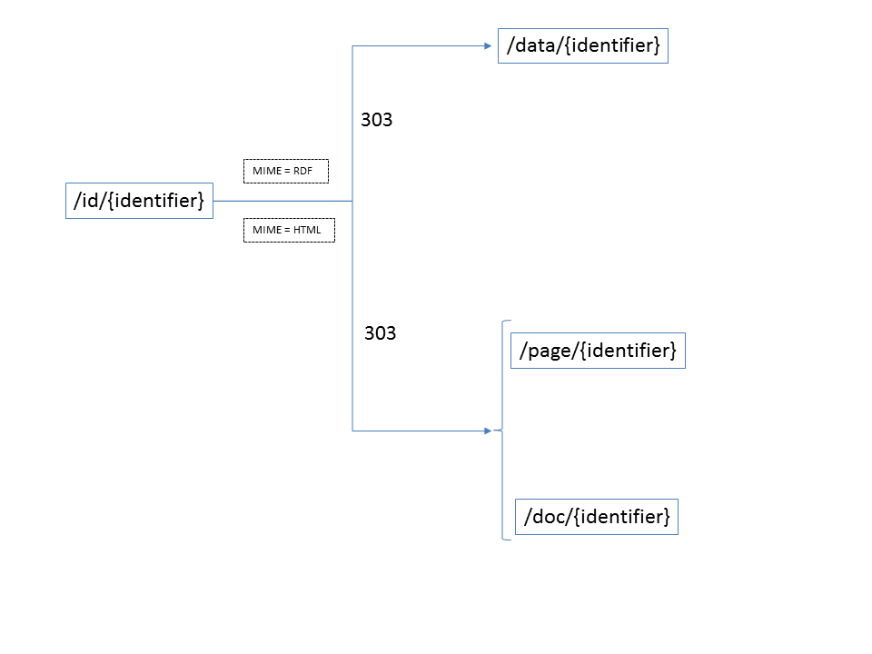

 Linked Open Data
================

## Introduction

The aim of Open Data initiatives like [Open Data Euskadi](http://opendata.euskadi.eus) is to publish government data in the most interoperable and rich way, so that citizens and other institutions can build interesting applications and perform deep analyses. Linked Data offers a suitable technology to do so, through the so called Linked Open Data.

[](http://5stardata.info)

The idea behind [Linked Data](https://www.w3.org/standards/semanticweb/data) is to publish data directly on the Web, using current technologies, with standards like RDF, OWL, and SPARQL. In order for such data to be useful, it must be identified with URIs, accesible through HTTP, and most importantly, linked to other Linked Data resources, to be a part of the Linked Open Data Cloud.

[](http://lod-cloud.net/versions/2017-08-22/lod.png)

By publishing Open Data as Linked Data, 3rd parties (humans or programs) can browse the data through links and perform interesting queries on integrated data.

In Open Data Euskadi, we have chosen data from different sources (Open Data Euskadi catalog, Legegunea, web content, etc.) and we have converted it to Linked Data. This documentation is provided to make the consumption of such data easier to developers, citisens, journalists, etc.

## Technology stack

### Linked Data

Linked Data is based on following four principles:

1. Identify every data item (entity or relationship) with a URI.

2. Make those URIs Hypertext Transfer Protocol (HTTP) resolvable, that is, when the URI is requested a document containing information about the entity can be obtained.
 
3. Provide the information using an open formatting standard when an entity is requested by HTTP. The format provided should be determined by HTTP content negotiation between the client and the server (e.g. RDF for an automatic agent, or Hypertext Markup Language (HTML) for a human user), so that the entity and its representations are decoupled. Importantly, the RDF format should always be available.

4. Ensure, to the greatest extent possible, that the information provided by URI resolution contains typed relations to other entities, so that the agent can traverse those relations to discover new information, analogously to how humans browse the web. 

### Resource Description Framework (RDF)

RDF can be described as the "HTML for data" (https://www.w3.org/TR/rdf11-primer/): a shared language for representing data on the Web. RDF is based on representing data as triples of the form subject-predicate-object ("Bob"-"is interested in"-"Mona Lisa"): by adding this triples together, we obtain a graph. Each entity (subject, predicate, or object) is identified by a URI, except in the cases of objects, that can be literals. RDF can be stored in Triple Stores: Blazegraph is the one we use (https://www.blazegraph.com/).

### SPARQL

SPARQL is a query language for RDF (https://www.w3.org/TR/sparql11-overview/). A Triple Store exposes a SPARQL endpoint.

### Web Ontology Language (OWL)

OWL is a Knowledge Representation language to build ontologies (https://www.w3.org/TR/owl2-primer/). An ontology is a vocabulary we use to describe general properties about the data we publish, through axioms. All the entities in an OWL Ontology are identified by URIs, except literals.

### Shapes Constraint Language (SHACL)

SHACL is a language for validating RDF data (https://www.w3.org/TR/shacl/). With SHACL, constrained can be defined, and check whether an RDF graph complies with them.

## URI policy

In Linked Data, resources are identified by URIs. This means that URIs should be persistent and well defined (See references bellow for best practices on URI policies). We have followed the [NTI](https://www.boe.es/diario_boe/txt.php?id=BOE-A-2013-2380) scheme for URIs, with a caveat: instead of using the word "recurso", we are using the word "id" (Yes, we do know that a URI bears no semantics and therefore "recurso" is as good as any word, but we live in a community with two official languages and we think we should not favour one for the URIs). Therefore, you can expect the URIs at Open Data Euskadi to follow the pattern `http://euskadi.eus/id/{sector}/{domain}/{ClassName}/{Identifier}`, where:

* `sector`: one of the sectors provided by the NTI (e.g. `environment`), translated from spanish to english.
* `domain`: the realm to which the resource belongs, defined by Open Data Euskadi (e.g. `air-quality`).
* `ClassName`: the name of the class of which this resource is an instance. In other words, the name of the resource at the other end of the `rdf:type` predicate (e.g. `observation`, from `http://purl.org/linked-data/cube#Observation`).
* `Identifier`: a unique identifier, generated from the original data (e.g. `AV-GASTEIZ-2017-01-26`).

So a real URI, identifying an observation of air quality that follows the [Data Cube](https://www.w3.org/TR/vocab-data-cube/) model, looks like: `<http://euskadi.eus/id/environment/air-quality/observation/AV-GASTEIZ-2017-01-26>`.


Resource URIs of RDF data that was obtained from [Legegunea](http://www.legegunea.euskadi.eus) site follow the URI pattern defined by the [European Legislation Identifier](http://eur-lex.europa.eu/eli-register/about.html) (ELI) project:

```
http://legegunea.euskadi.eus/eli/{jurisdiction}/{type}/{year}/{month}/{day}/{naturalidentifier}/{version}/{pointintime}/{language}/{format}
```
 
Apart from resources, the followng entities also have URI schemes defined: 

* OWL Classes: `http://euskadi.eus/def/{OntologyName}#{ClassName}`
* OWL properties: `http://euskadi.eus/def/{OntologyName}#{PropertyName}`
* OWL Ontology: `http://euskadi.eus/def/{OntologyName}`
* SKOS Concept: `http://euskadi.eus/kos/{ConceptName}`
* Linked Data distribution in a DCAT file: `http://euskadi.eus/distribution/{DistributionName}`
* Named Graph: `http://euskadi.eus/graph/{NamedGraph}`

## Content negotiation
An important notion of Linked Data is that a URI identifies a resource (Iñigo Urkullu), but a resource can have different representations of the same content (An HTML page describing Iñigo Urkullu, RDF data describing Iñigo Urkullu, etc.). [Content negotiation](https://tools.ietf.org/html/rfc7231#section-3.4) is the process by which the server provides the appropriate representation for each client, according to the MIME type of the `Accept` header that the client provides (`text/html` for a web browser, `application/rdf+xml` for an RDF agent, etc.)

The Content Negotiation at Open Data Euskadi is designed in the same way as in DBPedia. There is a URI with the token  `id` (`resource` in DBpedia), and the content negotiation process redirects the client with HTTP 303 codes to the appropriate URLs containing representations (`page` or `data` URLs). In the case of Open Data Euskadi there is an additional consideration since there are two types of pages: pages that represent only data (`doc`) and pages that represent web content that was transposed to RDF (`page`) (See Web content bellow). 



The list of supported MIME types can be found at the [Blazegraph REST API documentation](https://wiki.blazegraph.com/wiki/index.php/REST_API#MIME_Types).

## Relation between Open Data Euskadi datasets and Named Graphs in the Triple Store

[Named Graphs](https://www.w3.org/TR/sparql11-query/#namedGraphs) provide a mechanism to organise RDF triples into meaningful groups, since a Named Graph is a collection of RDF statements identified by a URI. Named Graphs are useful to organise the data in a Triple Store, and they also offer the possibility of recording the provenance of data in triples, since the URI of the named Graph can be the subject of more (metadata) triples.


The Named Graph and metadata mechanism is used in this project to add provenance information to the RDF datasets generated from [Open Data Euskadi datasets](http://opendata.euskadi.eus/catalogo-datos/). Those datasets already have DCAT metadata, so the DCAT is "recycled" to obtain the metadata of the datasets that are created by converting existing Open Data Euskadi datasets to RDF (normally from CSV):


Detail of DCAT:


This means that SPARQL can be used to query data and metadata, using the DCAT graphs:

```
DCAT SPARQL example
```

[Enlace directo a URL de query que consulta DCATs para datasets con distribucion RDF/XML](https://github.com/opendata-euskadi/WebDocumentacionLinkedDataOpenDataEuskadi/issues/2)

[Enlace directo a URL de query que consulta DCATs para datasets con distribucion Linked Data](https://github.com/opendata-euskadi/WebDocumentacionLinkedDataOpenDataEuskadi/issues/2)

[Enlace directo a URL de query que consulta DCATs para datasets con distribucion CSV?](https://github.com/opendata-euskadi/WebDocumentacionLinkedDataOpenDataEuskadi/issues/2)


## Relation between Web content and Named Graphs in the Triple Store

Many webs of the http://euskadi.eus domain have been annotated with terms from the Schema vocabulary (http://schema.org), adding [JSON-LD](https://json-ld.org/) snippets to them. Since JSON-LD is RDF, the content created for the webs is also stored in the Triple Store.

[El contenido web tiene un DCAT?Named Graph URI del contenido web?](https://github.com/opendata-euskadi/WebDocumentacionLinkedDataOpenDataEuskadi/issues/3)

## To know more

### Specifications, standards, and general purpose vocabularies

* URI (Uniform Resource Identifier): https://tools.ietf.org/html/rfc3986
* RDF (Resource Description Framework): https://www.w3.org/TR/rdf11-primer/
* OWL (Web Ontology Language): https://www.w3.org/TR/owl2-primer/
* SPARQL (SPARQL Protocol and RDF Query Language): https://www.w3.org/TR/sparql11-query/
* SHACL (Shapes Constraint Language): https://www.w3.org/TR/shacl/
* SKOS (Simple Knowledge Organization System): https://www.w3.org/TR/2009/NOTE-skos-primer-20090818/
* DCAT (Data Catalog Vocabulary): https://www.w3.org/TR/vocab-dcat/
* VOID (Vocabulary of Interlinked Datasets): https://www.w3.org/TR/void/
* PROV: https://www.w3.org/TR/prov-overview/
* JSON-LD: https://www.w3.org/TR/json-ld/
* Schema: http://schema.org/

### Tools used in the project

* ELDA: http://epimorphics.github.io/elda/
* YASGUI: http://about.yasgui.org/
* Blazegraph: https://www.blazegraph.com/
* RDF4J: http://rdf4j.org/
* Jena: http://jena.apache.org/
* Protégé: https://protege.stanford.edu/
* Silk: http://silkframework.org/
* LODE: http://www.essepuntato.it/lode

### Online tools

* W3C RDF validator: https://www.w3.org/RDF/Validator/
* Easy RDF converter: http://www.easyrdf.org/converter

### Linked Open Data projects

* [Biblioteca Nacional de España](http://www.bne.es/es/Inicio/Perfiles/Bibliotecarios/DatosEnlazados/index.html)
* [Aragón Open Data](https://opendata.aragon.es/aragopedia/)
* [Ordnance Survey Linked Data Platform](http://data.ordnancesurvey.co.uk/)
* [Scotland statistics](http://statistics.gov.scot/)
* [Office for National Statistics Geography Linked Data](http://statistics.data.gov.uk/)
* [Statistical Linked Open Data of Japan](http://data.e-stat.go.jp/lodw/en)
* [British National Library](http://bnb.data.bl.uk/)
* [Wikidata](https://www.wikidata.org/)
* [DBpedia](http://wiki.dbpedia.org/)
* [GeoNames](http://www.geonames.org/)
* [European Legislation Identifier](http://eur-lex.europa.eu/eli-register/about.html)

### Interesting articles and posts

* [JSON-LD and why I hate the Semantic Web](http://manu.sporny.org/2014/json-ld-origins-2/)
* https://www.w3.org/2001/tag/issues.html#httpRange-14
* http://richard.cyganiak.de/blog/2008/03/what-is-your-rdf-browsers-accept-header/
* https://httpd.apache.org/docs/trunk/content-negotiation.html#better
* http://httpd.apache.org/docs/current/content-negotiation.html
* http://docs.rdf4j.org/rest-api/#_content_types
* https://www.w3.org/TR/webarch/
* https://developer.mozilla.org/en-US/docs/Web/HTTP/Content_negotiation/List_of_default_Accept_values#Values_for_an_image
* https://www.w3.org/Consortium/Persistence
* https://www.w3.org/blog/2006/02/content-negotiation/

### Linked Data Best Practices

* NTI (https://www.boe.es/diario_boe/txt.php?id=BOE-A-2013-2380)
* Linking Open Government Data (https://logd.tw.rpi.edu/instance-hub-uri-design)
* Designing URI Sets for the UK Public Sector (https://www.gov.uk/government/publications/designing-uri-sets-for-the-uk-public-sector)
* Creating URIs (https://data.gov.uk/resources/uris)
* Data On the Web Best Practices (https://www.w3.org/TR/dwbp/)
* Study on Persistent URIs (http://philarcher.org/diary/2013/uripersistence/)
* Cool URIs for the Semantic Web (https://www.w3.org/TR/cooluris/)
* Cool URIs don't change (https://www.w3.org/Provider/Style/URI.html)
* Linking Government data (http://www.springer.com/us/book/9781461417668)
* Linked Data - Evolving the Web into a global Data Space (http://linkeddatabook.com/editions/1.0/)
* Linked Data - Structured data on the Web (https://www.amazon.com/Linked-Data-Structured-Web/dp/1617290394)
* Best practices for Publishing Linked Data (https://www.w3.org/TR/ld-bp/)
* Best Practice Recipes for Publishing RDF Vocabularies (https://www.w3.org/TR/swbp-vocab-pub)
